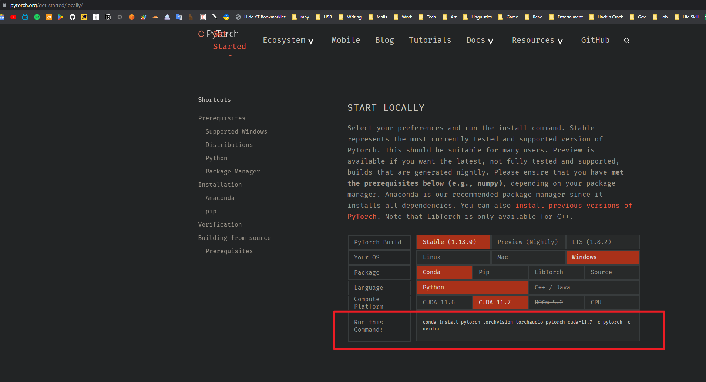

> This is the folder where my customized files are stored

# Install

## Prep

1. Install conda 
    miniconda vs anaconda 
    - miniconda is the bare minimum version, while anaconda comes with many packages pre-installed.
    - add conda to path despite the warning
    - uninstall and reinstall conda if httperrors encountered during conda use.
2. Install CUDA
3. Install [PyTorch](https://pytorch.org/get-started/locally/)
   
4. Create Virtual Enviroment with conda 
    1. create env 
        `conda create --name {cutom_env_name} {a starting package name or just type in pip/python}`
    2. activate env 
        `conda activate {cutom_env_name}`
    3. deactivate env 
        `conda deactivate`
5. Install tortoise-tts and dependencies. 
    1. git clone `tortoise-tts` repository
    2. cd to the cloned `tortoise-tts` dir and run `python setup.py install`
    3. use pip install missing packages if any
